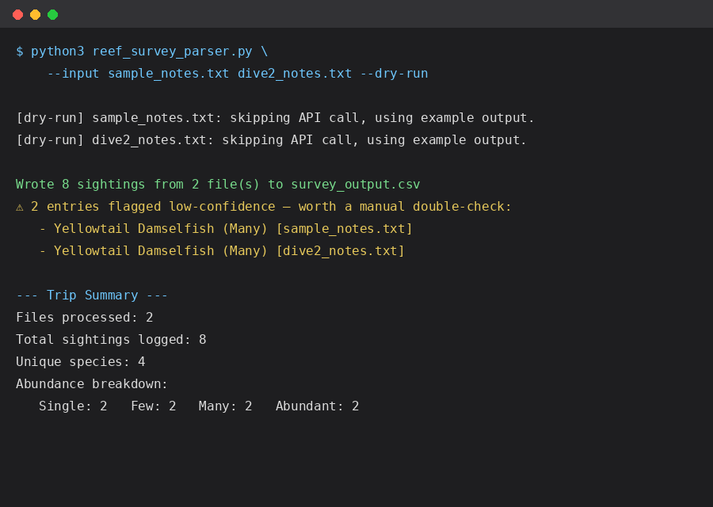

# REEF Survey Log Parser

A small Python tool that turns freeform fish survey notes — from one dive
or a whole trip's worth — into structured data matching REEF's Volunteer
Fish Survey Project (VFSP) format, using the Claude API.

## Why

REEF's Volunteer Fish Survey Project relies on divers and snorkelers logging
species and abundance ("Single / Few / Many / Abundant") for every dive.
In practice, a lot of that logging starts as loose notes — jotted on a
slate underwater or typed up quickly after surfacing — before being
manually re-entered into REEF's structured submission form. This script
automates that re-entry step: it reads one or more freeform notes files
and outputs a single merged CSV of species + abundance category, flagging
anything it wasn't confident about so a human can double-check before
submitting.

## How it works

1. Takes one or more text files of freeform survey notes as input (e.g.
   one file per dive on a multi-dive trip)
2. For each file, sends the notes to the Claude API with a system prompt
   describing REEF's abundance-category scale (Single = 1, Few = 2-10,
   Many = 11-100, Abundant = 100+) and asks for a structured JSON response
3. Parses each response and tags every extracted sighting with the source
   file it came from
4. Cross-checks each extracted species name against a reference set of
   REEF's known common-name conventions, flagging anything unverified so a
   volunteer can catch typos or non-standard names before submitting
5. Merges everything into a single CSV
   (`source_file, common_name, abundance_category, confidence, in_reef_id_list`)
6. Prints a trip-level summary — total sightings, unique species, an
   abundance-category breakdown, and any low-confidence or unverified
   entries worth a manual look

## Running it (dry-run, no API key needed)



## Usage

```bash
export ANTHROPIC_API_KEY=your_key_here
python reef_survey_parser.py --input dive1.txt dive2.txt --output survey_output.csv
```

To preview the output shape without an API key:

```bash
python reef_survey_parser.py --input sample_notes.txt dive2_notes.txt --dry-run
```

## Example

Input (`sample_notes.txt`):
> Saw a ton of sergeant majors hanging around the reef structure, probably
> over a hundred of them schooling. A few blue tangs grazing on algae,
> maybe 5-6. One nurse shark resting under a ledge...

Output (`survey_output.csv`, merged across both input files):
| source_file | common_name | abundance_category | confidence | in_reef_id_list |
|---|---|---|---|---|
| sample_notes.txt | Blue Tang | Few | high | yes |
| sample_notes.txt | Nurse Shark | Single | high | yes |
| sample_notes.txt | Sergeant Major | Abundant | high | yes |
| sample_notes.txt | Yellowtail Damselfish | Many | low | yes |
| dive2_notes.txt | ... | ... | ... | ... |

## Next steps / what I'd build out further

- Pull REEF's full official species ID list (currently a small reference
  sample) so the `in_reef_id_list` check covers every region, not just a
  Tropical Western Atlantic sample
- Support REEF's full survey metadata (site, date, depth, visibility)
- Simple web form front-end so non-technical volunteers can paste notes
  directly instead of running a script
